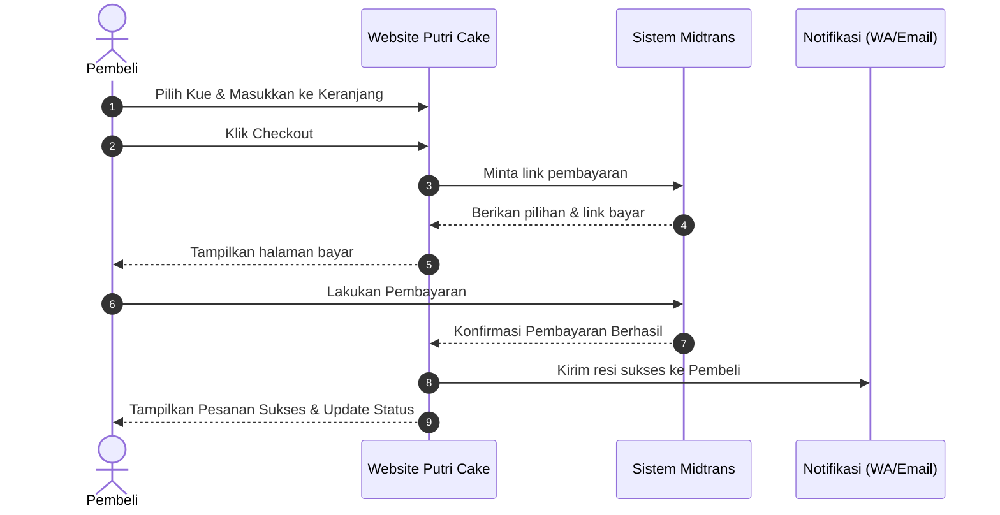
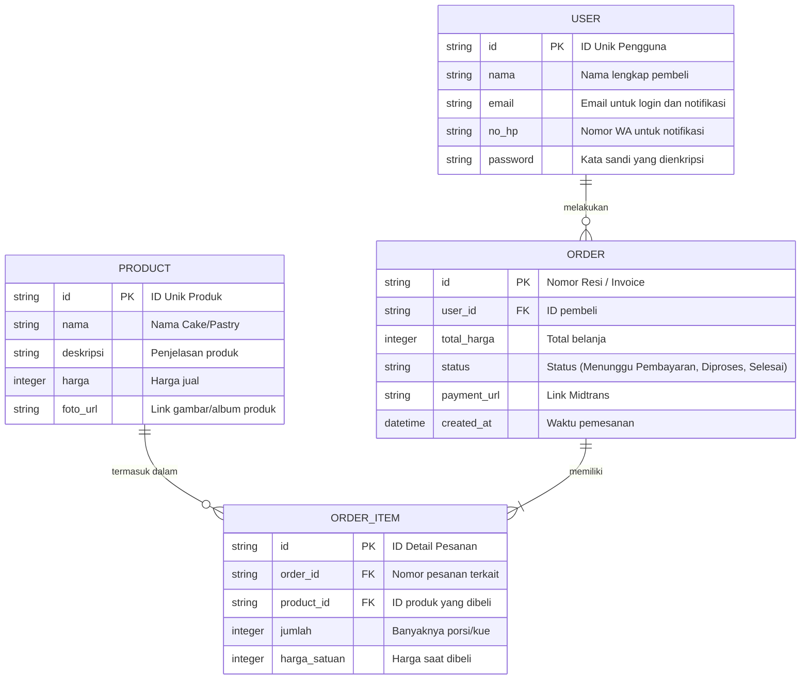

# PRD — Project Requirements Document

## 1. Overview
Saat ini, pelanggan yang ingin membeli kue atau pastry sering kali harus melakukan pemesanan secara manual melalui WhatsApp atau media sosial. Proses ini kurang praktis karena pelanggan harus menanyakan stok, harga, mentransfer pembayaran secara manual, dan mengecek status pesanan satu per satu. 

**PUTRI CAKE** hadir sebagai solusi berupa aplikasi web bertema minimalis, cantik, dan lucu. Tujuan utamanya adalah membuat pengalaman membeli kue menjadi **lebih gampang**. Dari saat pertama kali membuka website, pengguna akan langsung disuguhkan katalog produk beserta harga. Pengguna dapat dengan mudah membuat akun, memilih kue, melakukan pembayaran otomatis, dan melacak status pesanannya dalam satu tempat yang terorganisir dengan rapi.

## 2. Requirements
Berikut adalah persyaratan utama untuk berjalannya sistem PUTRI CAKE:
- **Aksesibilitas:** Berbasis web dan responsif. Harus tampil dan berfungsi dengan baik saat diakses melalui *browser* dari Desktop, Laptop, maupun Handphone.
- **Pengguna Utama:** Sistem saat ini difokuskan sepenuhnya untuk **Pembeli** (Tidak ada fitur kompleks seperti admin panel untuk user, pengguna hanya fokus pada pengalaman berbelanja).
- **Notifikasi Otomatis:** Sistem harus dapat mengirimkan notifikasi kepada pengguna melalui WhatsApp atau Email segera setelah pembayaran dan pemesanan berhasil dilakukan.
- **Tampilan Visual:** Desain antarmuka (UI) harus menonjolkan visual yang menarik (album kue terlihat di halaman awal) dengan pengalaman navigasi yang intuitif.

## 3. Core Features
Fitur-fitur utama yang wajib ada pada peluncuran pertama (MVP):
- **Katalog Produk:** Menampilkan galeri foto kue dan pastry lengkap dengan harga dan deskripsinya di halaman utama sebelum pengguna login.
- **Manajemen Akun (Login/Daftar):** Akses masuk bagi pengguna yang tertarik untuk memesan agar data pengiriman dan histori pemesanannya tersimpan aman.
- **Keranjang Belanja (Cart):** Fitur untuk menyimpan produk yang ingin dibeli sebelum lanjut ke tahap pembayaran.
- **Checkout & Pembayaran Online:** Integrasi dengan *Payment Gateway* (Midtrans) untuk memproses berbagai metode pembayaran secara otomatis tanpa perlu konfirmasi manual dari pembeli.
- **Pelacakan & Histori Pesanan:** Dasbor di mana pengguna bisa melihat status pesanannya saat ini, melihat riwayat belanja sebelumnya, dan mencetak resi (invoice) pembelian.
- **Integrasi Chat WhatsApp:** Tombol akses cepat yang menghubungkan pembeli ke WhatsApp (dengan bantuan Chatbot) untuk bantuan layanan pelanggan.

## 4. User Flow
Langkah-langkah sederhana perjalanan pembeli (User Journey) dari awal hingga selesai:
1. User membuka website PUTRI CAKE dan langsung melihat katalog produk.
2. User melakukan pendaftaran akun baru atau login (masuk) ke akun yang sudah ada.
3. User memilih cake atau pastry favorit dan membacanya di halaman deskripsi.
4. User menambahkan produk pilihannya ke dalam keranjang belanja.
5. User melakukan *checkout* pesanan dan membayar langsung menggunakan sistem Midtrans (Bisa via transfer bank, e-wallet, dll).
6. Sistem secara otomatis memverifikasi pembayaran dan memproses pesanan.
7. User menerima notifikasi dan dapat mengecek status order serta riwayat pembelian di halaman dasbornya.
8. User dapat mencetak resi pesanannya atau menekan tombol WhatsApp jika membutuhkan bantuan.

## 5. Architecture
Berikut adalah gambaran high-level bagaimana pengguna berinteraksi dengan sistem PUTRI CAKE, terutama pada saat proses pemesanan dan pembayaran.

## 6. Database Schema
Untuk menyimpan data aplikasi agar berfungsi dengan baik, kita akan menggunakan tabel-tabel utama berikut:

1. **User (Pengguna):** Menyimpan data login dan profil pembeli.
2. **Product (Produk):** Menyimpan data katalog kue dan pastry.
3. **Order (Pesanan):** Menyimpan catatan transaksi (checkout) dari pembeli.
4. **Order_Item (Detail Pesanan):** Menyimpan daftar produk apa saja yang dibeli di dalam satu nomor pesanan.

## 7. Tech Stack
Berikut adalah rekomendasi teknologi terbaik untuk mewujudkan PUTRI CAKE secara cepat, stabil, dan modern:
- **Frontend & Backend (Full-stack Framework):** Next.js (Memberikan performa web yang cepat, aman, dan mempermudah proses pembuatan sisi tampilan maupun fungsi backend dalam satu tempat).
- **Desain & UI Components:** Tailwind CSS & shadcn/ui (Sangat cocok untuk membuat tampilan bertema minimalis, cantik, unik, dan responsif dengan pengembangan yang cepat).
- **Database:** SQLite (Database ringan dan sangat mumpuni untuk MVP tahap awal tanpa biaya server data yang mahal).
- **ORM (Penghubung Database):** Drizzle ORM (Mempermudah sistem membaca dan menulis data ke database dengan aman).
- **Authentication (Keamanan Akun):** Better Auth (Memberikan fitur login/daftar yang aman dan mudah diintegrasikan).
- **Payment Gateway:** Midtrans (Untuk menerima berbagai metode pembayaran dari pembeli secara instan dan otomatis).